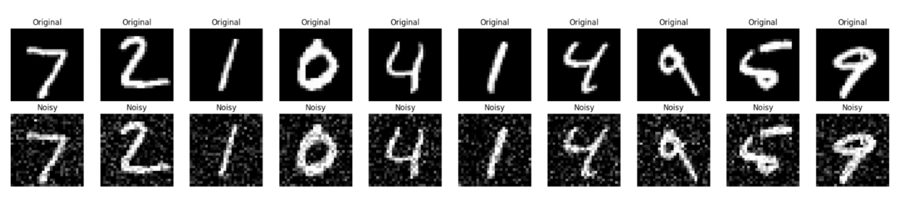
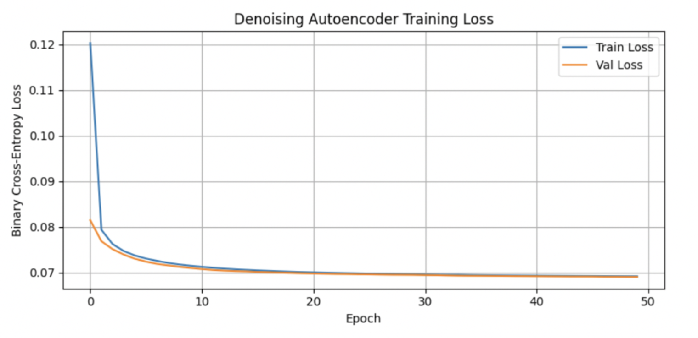
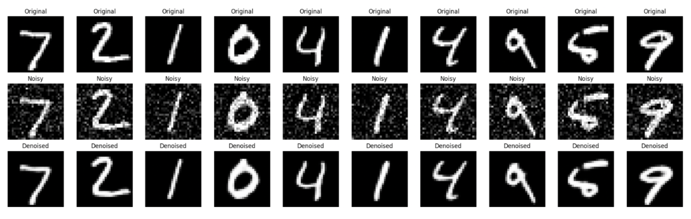
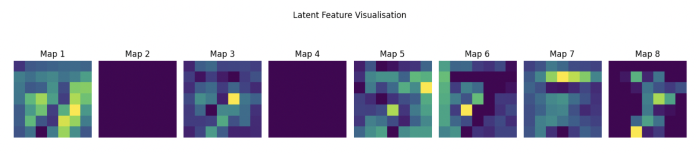

# Denoising Autoencoders for Image Reconstruction

*A Machine Learning & Neural Networks Coursework Project*

## Course Information

**Course:** 7PAM2021 — Machine Learning & Neural Networks  
**Tutorial Topic:** Denoising Autoencoders for Image Reconstruction  
**Student Name:** Muhammad Wasal Imtiaz  
**Student ID:** 24077342

## Project Overview

This repository contains the implementation and tutorial code for a **Convolutional Denoising Autoencoder (DAE)** trained on the **MNIST handwritten digits dataset**.

The goal of this project is to:

- Introduce the concept of autoencoders
- Explain why denoising autoencoders are useful
- Build a complete deep-learning pipeline for image reconstruction from noise
- Generate visualisations of training behaviour, latent features, and reconstructed outputs
- Support the written PDF tutorial submitted for assessment

This work was completed as part of the Machine Learning & Neural Networks coursework.

## What is a Denoising Autoencoder?

A denoising autoencoder (DAE) is a type of neural network designed to reconstruct clean inputs from intentionally corrupted data.

It works by:

1. Encoding the input into a compressed latent space
2. Removing noise through learned representations
3. Decoding the latent features into a clean output image

In this project, Gaussian noise was added to MNIST digits, and the DAE learned to reconstruct clean digits.

## Repository Contents

| File | Description |
|------|-------------|
| `denoising-autoencoder-tutorial-24077342.ipynb` | Main notebook containing full implementation, training loop, and visualisations |
| `README.md` | Overview and instructions |
| `LICENSE` | MIT License |
| `FIGURES` | Saved visualisation plots and results |

## How to Run the Notebook

### 1. Install dependencies

```bash
pip install tensorflow keras matplotlib numpy
```

### 2. Open the notebook

```bash
jupyter notebook denoising-autoencoder-tutorial-24077342.ipynb
```

### 3. Run all cells

The notebook will:

- Load MNIST
- Add noise
- Train a convolutional autoencoder
- Plot training curves
- Show reconstruction results
- Visualise latent feature maps

## Key Outputs Generated

The notebook produces:

- Original vs Noisy image samples
- Training & validation loss curves
- Original → Noisy → Reconstructed comparisons
- Latent feature map visualisations

These figures appear in the submitted PDF tutorial as required by the assignment rubric.

### Visual Results

#### Original vs Noisy Input Comparison



*Comparison of original MNIST digits (top row) with their noisy counterparts (bottom row) after adding Gaussian noise.*

#### Training Loss Curves



*Training and validation loss curves showing the model's convergence over 50 epochs. Both curves demonstrate rapid initial improvement followed by stabilization, indicating effective learning without overfitting.*

#### Denoising Results



*Three-row comparison showing Original (top), Noisy (middle), and Denoised (bottom) images. The denoised outputs demonstrate the autoencoder's ability to reconstruct clean digits from corrupted inputs.*

#### Latent Feature Visualisation



*Visualisation of 8 learned feature maps from the latent space. These maps show the compressed, noise-invariant representations learned by the autoencoder, capable of reconstructing meaningful structure even when input signals are degraded.*

## References

- Vincent, P., Larochelle, H., Bengio, Y., & Manzagol, P. (2008). Extracting and composing robust features with denoising autoencoders.
- Goodfellow, I., Bengio, Y., & Courville, A. (2016). Deep Learning. MIT Press.
- Chollet, F. (2021). Deep Learning with Python (2nd ed.). Manning Publications.
- Keras Documentation – https://keras.io/examples/vision/autoencoder/
- MNIST Dataset – http://yann.lecun.com/exdb/mnist/

## License

This project is licensed under the MIT License.

You are free to use, modify, and distribute this code with attribution.

## Assessment Submission Note

This repository accompanies the PDF tutorial submitted via CodeGrade.

The notebook here is fully reproducible and contains all intermediate steps, as required by the coursework specification.
